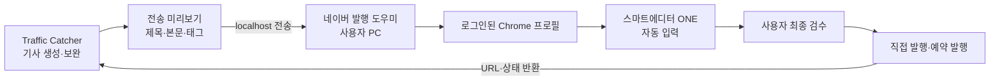

# Traffic Catcher × 네이버 블로그 연동 프로그램 기획안

## 1. 기획 목적

Traffic Catcher에서 생성·보완한 기사 원고를 별도의 로컬 프로그램으로 전달하고, 사용자가 내용을 검수한 뒤 네이버 블로그 스마트에디터 ONE에 안전하게 옮길 수 있도록 한다.

네이버 블로그 글 작성·수정·삭제용 공식 Open API가 제공되지 않는 현재 환경을 전제로 한다. 따라서 네이버 계정, 로그인 쿠키, 브라우저 세션은 Cloudflare Pages나 Traffic Catcher 서버로 전송하지 않고 사용자 PC 안에서만 처리한다.

## 2. 권장 운영 원칙

- **반자동 발행을 기본값으로 채택한다.** 프로그램은 제목·본문·태그·이미지를 편집기에 입력하되, 최종 `발행` 버튼은 사용자가 직접 누른다.
- 캡차 우회, 탐지 회피, 무인 대량 발행 기능은 구현하지 않는다.
- 네이버 로그인 정보와 쿠키를 서버에 저장하지 않는다.
- 자동 입력 전후로 사용자가 원고를 검수하고 수정할 수 있게 한다.
- 네이버 편집기 구조가 바뀌면 자동 입력을 중단하고 사용자에게 원인을 명확하게 표시한다.

## 3. 사용자 흐름

1. Traffic Catcher에서 키워드를 선택한다.
2. Gemini API로 기사와 쇼츠 원고를 생성한다.
3. 필요한 내용을 `AI로 기사 보완하기` 기능으로 수정한다.
4. `네이버 블로그로 보내기` 버튼을 누른다.
5. 로컬 발행 도우미가 실행 중인지 확인한다.
6. 전송 전 미리보기에서 제목, 본문, 태그, 대표 이미지, 카테고리를 확인한다.
7. 로컬 발행 도우미가 사용자의 로그인된 네이버 블로그 글쓰기 화면을 연다.
8. 제목·본문·태그를 입력한다.
9. 사용자가 편집기에서 최종 검수 후 직접 발행 또는 예약 발행한다.
10. 발행 완료 시 URL을 Traffic Catcher의 발행 이력에 기록한다.

## 4. 전체 구조



## 5. 프로그램 구성

### A. Traffic Catcher 웹 화면

기사 작성 완료 화면 하단에 다음 기능을 추가한다.

- `네이버 블로그로 보내기` 버튼
- 전송 미리보기 창
- 제목 편집
- 본문 미리보기 및 간단한 서식 확인
- 태그 편집
- 대표 이미지 선택
- 카테고리 선택 또는 메모
- `로컬 도우미 연결됨/연결 안 됨` 상태 표시
- 전송 결과와 오류 메시지 표시

### B. 네이버 블로그 로컬 발행 도우미

별도 Python 프로그램으로 구성한다.

- 로컬 전용 API 서버: `127.0.0.1`에서만 요청 수신
- 브라우저 제어: Playwright 우선 검토
- Chrome 사용자 프로필 또는 별도 전용 프로필 사용
- 네이버 로그인 화면과 글쓰기 화면 열기
- 제목·본문·태그·이미지 입력
- 입력 완료 후 최종 검수 화면에서 정지
- 발행 완료 URL과 상태 기록
- 편집기 변경, 로그인 만료, 캡차 발생 시 안전하게 중단

### C. 로컬 데이터 저장소

초기 버전은 SQLite를 사용한다.

- 전송 작업 ID
- 원고 제목과 키워드
- 생성·수정 시각
- 전송 상태: 대기/입력 중/검수 대기/완료/실패
- 발행 URL
- 오류 사유

비밀번호, 네이버 로그인 토큰, 원문 쿠키는 저장하지 않는다.

## 6. Traffic Catcher 연동 규격

웹 프로그램에서 로컬 도우미로 아래 데이터만 전달한다.

```json
{
  "request_id": "고유 작업 ID",
  "title": "블로그 제목",
  "body_markdown": "기사 본문",
  "tags": ["태그1", "태그2"],
  "category": "사용자 선택값",
  "images": [],
  "source_urls": [],
  "created_at": "ISO-8601 시각"
}
```

권장 로컬 API:

- `GET /health`: 로컬 도우미 실행 및 버전 확인
- `POST /drafts`: 원고 전달 및 작업 생성
- `GET /drafts/{id}`: 입력 진행 상태 확인
- `POST /drafts/{id}/open`: 네이버 편집기 열기
- `POST /drafts/{id}/confirm`: 사용자가 발행 결과 URL 저장

### 보안 규칙

- 서버는 `127.0.0.1`에만 바인딩한다.
- 최초 실행 시 생성한 로컬 연결 토큰을 요청 헤더로 확인한다.
- 허용 Origin은 로컬 Traffic Catcher와 `https://trafficcatcher.pages.dev`로 제한한다.
- 요청 크기, 본문 길이, 이미지 형식을 제한한다.
- 외부 URL 이미지는 자동 다운로드하지 않고 사용자 확인 후 처리한다.
- API 키, 로그인 정보, 브라우저 쿠키를 전송 데이터에 포함하지 않는다.

## 7. 편집기 입력 전략

### 1순위: 구조 기반 입력

Playwright의 접근성 역할, 표시 텍스트, 안정적인 편집 영역을 찾아 입력한다. 특정 난수 class명에 과도하게 의존하지 않는다.

### 2순위: 클립보드 기반 입력

구조 기반 입력이 정상 동작하지 않을 때 사용자의 명시적 동의 후 제목과 본문을 클립보드로 복사하고 붙여넣는다. 기존 클립보드 내용은 가능한 범위에서 복원한다.

### 실패 처리

- 로그인 만료: 로그인 화면을 표시하고 사용자 조작을 기다린다.
- 캡차 또는 계정 보호조치: 자동 진행을 즉시 중단한다.
- 편집기 요소 미탐지: 화면 캡처와 프로그램 버전을 오류 로그에 기록한다.
- 본문 일부 누락: 입력 전후 글자 수를 비교하고 불일치 경고를 표시한다.
- 발행 버튼: 기본 설정에서는 자동 클릭하지 않는다.

## 8. 화면 기획

### Traffic Catcher 기사 화면

- 기존 `복사` 버튼 옆에 `네이버 블로그로 보내기` 배치
- 연결 상태:
  - 🟢 로컬 도우미 연결됨
  - 🟡 네이버 로그인 확인 필요
  - 🔴 로컬 도우미 실행 필요
- 전송 전 필수 확인:
  - 제목 존재
  - 본문 최소 길이 충족
  - 출처 링크 형식 정상
  - 이미지 저작권 확인 체크

### 로컬 발행 도우미

- 오늘의 작업 목록
- 원고 미리보기
- `네이버 편집기 열기`
- `내용 입력하기`
- `입력 다시 시도`
- `발행 완료 기록`
- 오류 해결 안내

## 9. 개발 단계

### 1단계: 안전한 MVP

- Traffic Catcher에 전송 버튼과 미리보기 추가
- 로컬 도우미 `/health`, `/drafts` 구현
- 제목·본문·태그 전달
- 네이버 글쓰기 화면 열기
- 클립보드 복사 지원
- 사용자가 직접 붙여넣고 발행

**완료 기준:** 온라인과 로컬 Traffic Catcher 모두에서 원고가 로컬 도우미로 전달되고, 사용자가 2~3번의 조작으로 발행할 수 있다.

### 2단계: 편집기 자동 입력

- Playwright 기반 제목·본문·태그 입력
- 로그인 세션 유지
- 입력 전후 글자 수 검증
- 네이버 UI 변경 감지 및 오류 안내
- 최종 발행 전 사용자 확인

**완료 기준:** 정상 로그인 상태에서 원고 입력 성공률 95% 이상, 입력 실패 시 잘못된 발행 없이 중단된다.

### 3단계: 운영 편의 기능

- 카테고리 설정
- 이미지 업로드 보조
- 예약 발행 설정 보조
- 발행 이력과 URL 관리
- 중복 원고 경고
- 작업 백업과 내보내기

## 10. 제외 범위

- 캡차 자동 해제 또는 우회
- 브라우저 자동화 탐지 회피
- 랜덤 지연을 이용한 어뷰징 탐지 회피
- 다계정 무인 대량 발행
- 사용자의 확인 없는 자동 발행
- 네이버 비밀번호 수집·저장·전송

이 기능들은 계정 보호조치, 서비스 약관 위반, 검색 노출 제한 및 보안 사고 위험을 크게 높이므로 제품 범위에서 제외한다.

## 11. 권장 기술 스택

- UI: 기존 Traffic Catcher HTML/CSS/JavaScript
- 로컬 API: Python + Flask 또는 FastAPI
- 브라우저 자동화: Playwright
- 로컬 저장: SQLite
- 패키징: Windows 실행 파일 또는 간단한 설치 프로그램
- 로그: 민감정보를 제거한 구조화 로그

현재 Traffic Catcher가 Python/Flask와 단일 HTML 프론트엔드를 사용하므로, 초기 구현은 기존 기술을 재사용하는 것이 개발·유지보수 비용이 가장 낮다.

## 12. 예상 위험과 대응

| 위험 | 영향 | 대응 |
|---|---|---|
| 네이버 편집기 UI 변경 | 자동 입력 실패 | 버전 감지, 선택자 모듈화, 수동 복사 방식으로 전환 |
| 로그인 만료·2단계 인증 | 작업 중단 | 사용자 로그인 대기 상태 제공 |
| 캡차·보호조치 | 계정 사용 제한 가능 | 자동 진행 중단, 원인 안내 |
| 본문 서식 손실 | 품질 저하 | Markdown 변환 규칙과 입력 후 미리보기 비교 |
| Cloudflare에서 localhost 접근 제한 | 온라인 연동 실패 | CORS 제한, HTTPS 페이지용 로컬 연결 방식 사전 검증 |
| 민감정보 노출 | 보안 사고 | 계정 정보 미수집, 로컬 전용 저장, 로그 마스킹 |

## 13. 최종 제안

별도 프로그램 연동은 가능하다. 다만 완전 자동 발행기가 아니라 **Traffic Catcher는 콘텐츠 제작**, **로컬 도우미는 네이버 편집기 입력**, **사용자는 최종 검수와 발행**을 담당하는 3단계 구조가 안정성과 유지보수성 면에서 가장 적합하다.

우선 1단계 MVP로 실제 네이버 편집기와 온라인 Cloudflare 환경의 연결 가능성을 검증한 뒤, 성공한 입력 방식만 2단계 자동 입력 기능으로 확장하는 것을 권장한다.
